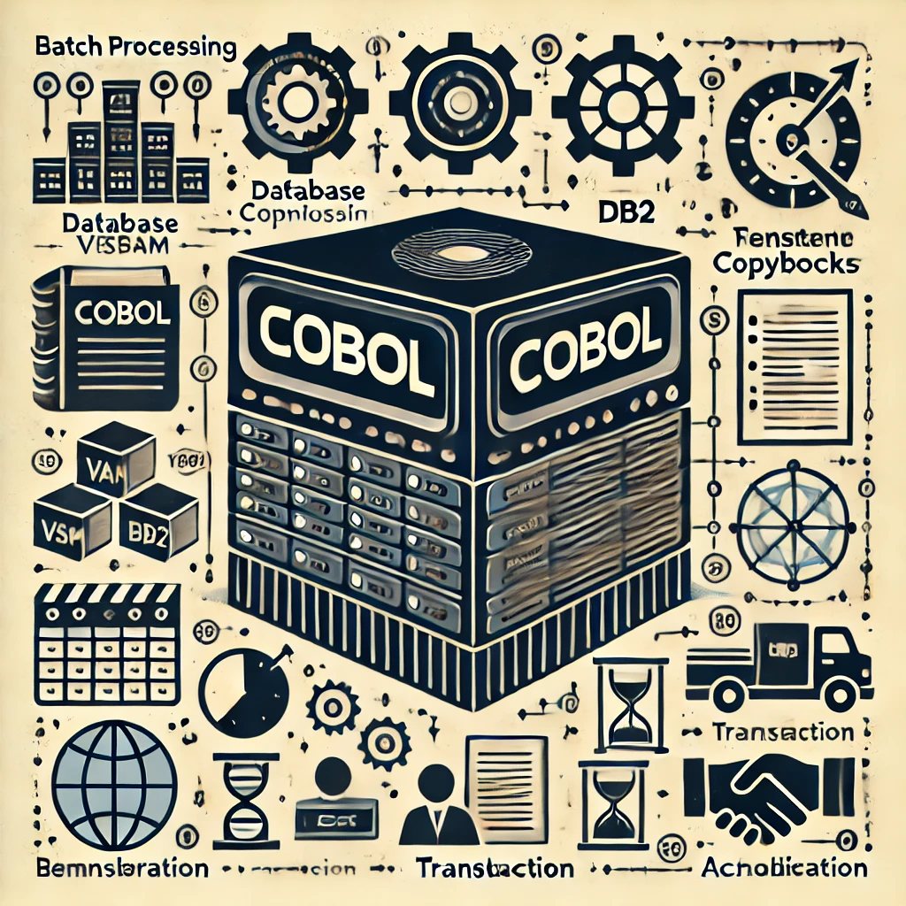

# COBOL Legacy Benchmark Suite: Investment Portfolio Management System



[]()
[]()

A production-grade implementation of an Investment Portfolio Management System designed to challenge and benchmark Large Language Model (LLM) translation tools, specifically for COBOL modernization efforts.

## Project Overview

This project presents a comprehensive COBOL-based system that simulates the complexity of real-world legacy applications. Developed using Anthropic Claude 3.5 Sonnet over five sprints, it serves as a robust test case for evaluating and fine-tuning LLM translation tools aimed at modernizing COBOL codebases.

### Purpose

- **Benchmarking LLMs**: Provides a complex, production-grade COBOL codebase to assess the capabilities of LLMs in translating legacy code to modern languages like Java or C#.
- **COBOL Modernization Reference**: Serves as a detailed example for the COBOL modernization community, addressing the scarcity of publicly available, complex COBOL projects.
- **LLM Development and Testing**: Aids in the development and fine-tuning of LLM translation tools by offering realistic challenges beyond simplistic code snippets.

## Key Features

- **Complex Business Logic**: Implements full transaction processing, portfolio management, and financial calculations.
- **Comprehensive System Architecture**: Includes batch processing, online transaction processing, reporting, utilities, and testing components.
- **Production-Grade Standards**: Follows industry best practices for error handling, data validation, security, and performance optimization.
- **Mainframe Environment Simulation**: Emulates key features of mainframe environments, exercising COBOL and z/OS functionalities.

## High-Level Description

The system simulates an investment portfolio management application that:

- Manages portfolios and transaction histories.
- Processes financial transactions and updates positions.
- Generates reports on positions, audits, and system statistics.
- Supports online inquiries for portfolio positions and transaction histories.

While it is not intended for actual deployment, it mirrors the complexity and structure of real-world COBOL applications found in mainframe environments.

## Development Approach

- **LLM Pair Programming**: Developed collaboratively with Anthropic Claude 3.5 Sonnet, turning requirements into design and code.
- **Five Sprints Execution**: Completed over five development sprints, each focusing on different system components.
- **Best Practices Implementation**: Adheres to standard mainframe development patterns and COBOL coding standards.
- **Comprehensive Documentation**: Includes detailed documentation to aid understanding and facilitate translation efforts.

## Project Structure

```
project-root/
├── documentation/          # Project documentation
│   ├── technical/         # Technical documentation and architecture
│   ├── operations/        # Operational guides and specifications
│   ├── user/              # User documentation and guides
│   └── assets/            # Shared documentation assets
│
└── src/                   # Source code root
    ├── programs/         # COBOL source programs
    │   ├── batch/       # Batch processing programs
    │   ├── online/      # Online transaction programs
    │   ├── utility/     # Utility programs
    │   ├── test/        # Test programs
    │   ├── common/      # Shared utility programs
    │   └── portfolio/   # Portfolio management programs
    │
    ├── copybook/         # COBOL copybooks
    │   ├── batch/       # Batch processing copybooks
    │   ├── online/      # Online processing copybooks
    │   ├── db2/         # Database-related copybooks
    │   └── common/      # Shared system copybooks
    │
    ├── database/         # Database definitions
    │   ├── vsam/        # VSAM file definitions
    │   └── db2/         # DB2 table and index definitions
    │
    ├── jcl/              # Job Control Language scripts
    │   ├── batch/       # Batch processing jobs
    │   ├── utility/     # Utility and maintenance jobs
    │   ├── test/        # Test execution jobs
    │   └── portfolio/   # Portfolio management jobs
    │
    ├── maps/             # BMS screen definitions
    ├── cics/             # CICS resource definitions
    └── templates/        # Code templates and standards
```

## System Architecture Overview

The system comprises several key components:

- **Batch Processing Layer**: Handles transaction validation (`TRNVAL00`), position updates (`POSUPD00`), and history loading (`HISTLD00`).
- **Online Layer**: Provides inquiry capabilities through `INQONLN`, allowing users to view portfolio positions and transaction histories.
- **Utility Programs**: Include file maintenance (`UTLMNT00`), system monitoring (`UTLMON00`), and data validation (`UTLVAL00`).
- **Reporting System**: Generates reports on positions (`RPTPOS00`), audits (`RPTAUD00`), and system statistics (`RPTSTA00`).
- **Test Components**: Consist of test data generation (`TSTGEN00`) and test validation (`TSTVAL00`) to support testing and benchmarking.

## Use in LLM Translation Tools Benchmarking

- **Complexity**: Offers a complex codebase that presents realistic challenges for LLMs, unlike simplistic examples.
- **Variety of Features**: Covers a wide range of COBOL and mainframe features, including VSAM files, DB2 database interactions, CICS transactions, and error handling mechanisms.
- **Benchmark Creation**: Serves as a foundation for creating benchmark translations and training pairs for developing and fine-tuning LLM translation tools.

## Development Status

Currently implemented components:

- ✅ Core Batch Processing Programs
- ✅ Online Inquiry System
- ✅ Utility Programs
- ✅ Reporting System
- ✅ Test Components
- ✅ System Monitoring Tools
- ✅ Security Framework

## Documentation

Comprehensive documentation is provided to facilitate understanding and translation:

- [System Architecture Document (SAD)](documentation/technical/system-architecture.md)
- [Data Dictionary](documentation/technical/data-dictionary.md)
- [Operations Guide](documentation/operations/README.md)
- [Test Data Specifications](documentation/operations/test-data-specs.md)

## Technical Standards

- **COBOL Standards**: Enterprise COBOL for z/OS compliance.
- **Mainframe Patterns**: Implements standard file handling, batch processing, and error handling patterns.
- **Database Integration**: Follows DB2 for z/OS SQL standards.
- **Online Processing**: Incorporates CICS transaction processing standards.
- **Security**: Adheres to mainframe security best practices.

## Quality Standards

- **Production-Grade Code**: Written to production standards suitable for z/OS deployment.
- **Error Handling**: Includes comprehensive error handling and recovery procedures.
- **Documentation**: Provides detailed documentation for all components.
- **Testing**: Contains test programs and data for validation purposes.

## Future Plans

- **LLM Translation Training Pairs**: Create benchmark translations to modern languages like Java or C#.
- **Fine-Tuning LLMs**: Use the project to enhance the capabilities of LLM translation tools in handling complex legacy codebases.
- **Community Contribution**: Encourage collaboration within the COBOL modernization community to improve and expand the benchmark.

## License

[Appropriate License]

## Contributing

Contributions are welcome, especially from those interested in COBOL modernization and LLM development. Please see the [Contributing Guidelines](CONTRIBUTING.md) for more information.
