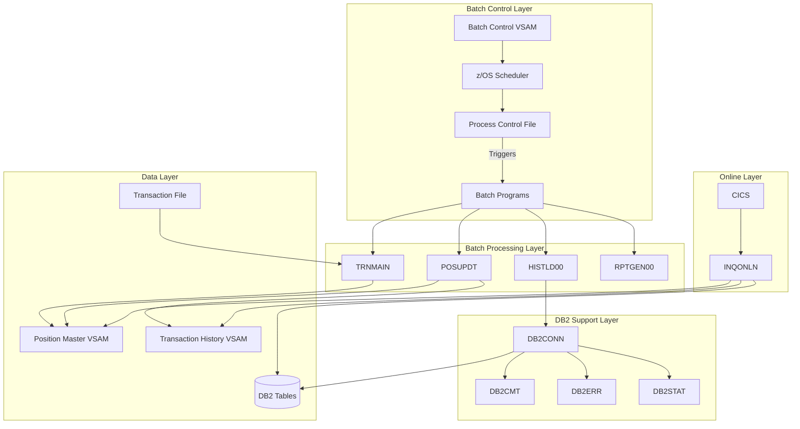
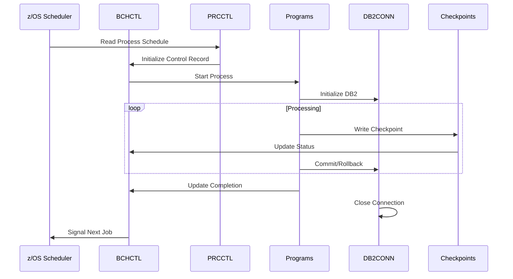
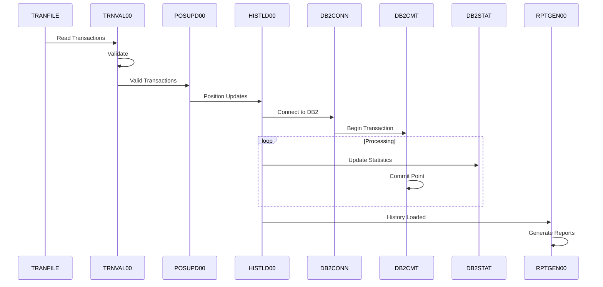
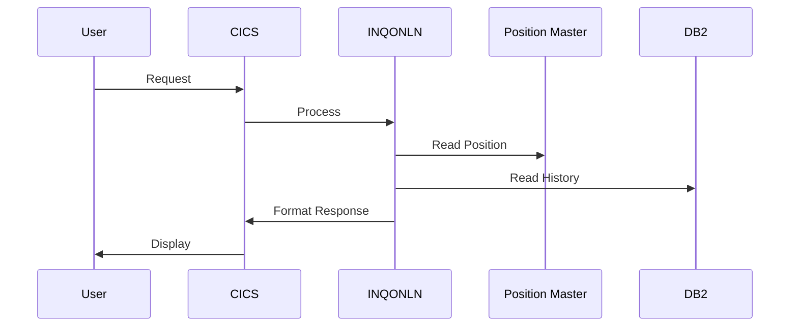
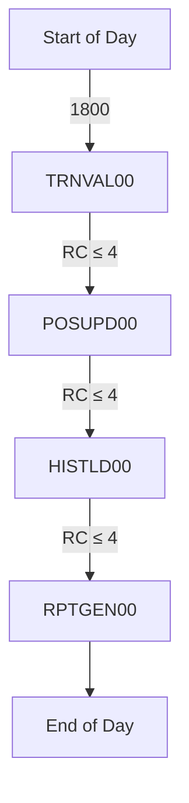
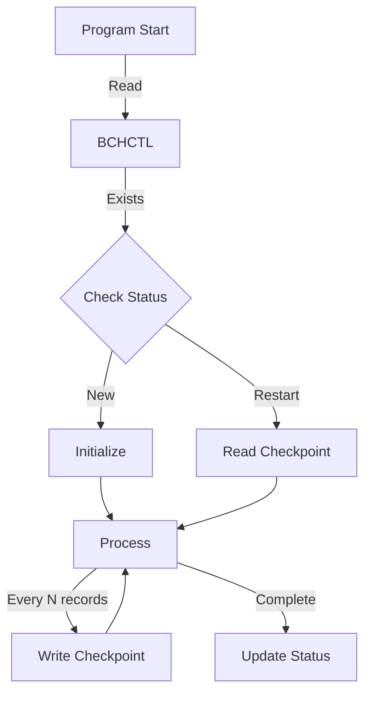
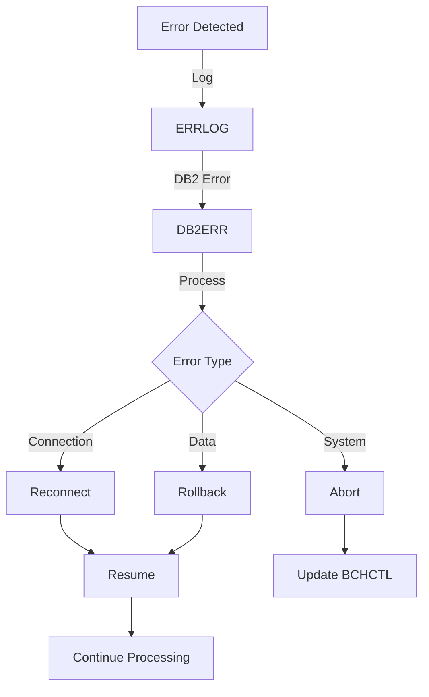

# System Architecture Document

Version: 1.2
Last Updated: 2024-10-29

## Important Note

This codebase represents a production-grade implementation of an Investment Portfolio Management System designed for z/OS environments. While the code is written to production standards and would be ready for z/OS deployment, this implementation serves as a reference architecture. The code:

- Is written in Enterprise COBOL for z/OS
- Uses standard z/OS file handling patterns
- Implements DB2 for z/OS SQL standards
- Follows mainframe batch processing best practices
- Includes complete JCL for deployment
- Contains all necessary copybooks and data definitions

This implementation represents what would be found in a running z/OS system, though it cannot be tested in a z/OS environment within this project's scope.

## 1. System Overview

### 1.1 High-Level Architecture



### 1.2 Component Descriptions

#### 1.2.1 Batch Control Components

- **Batch Control File (BCHCTL)**
  - Controls process execution
  - Maintains process status
  - Supports checkpoint/restart
- **Process Control File (PRCCTL)**
  - Defines process sequence
  - Specifies dependencies
  - Sets completion criteria

#### 1.2.2 Processing Components

- **TRNMAIN (TRNVAL00)**

  - Validates input transactions
  - Performs initial error checking
  - Prepares transactions for processing

- **POSUPDT (POSUPD00)**

  - Updates position records
  - Maintains cost basis
  - Records transaction history

- **HISTLD00**

  - Loads history to DB2
  - Maintains audit trail
  - Supports reporting

- **RPTGEN00**

  - Generates end-of-day reports
  - Produces error summaries
  - Creates audit reports

- **INQONLN**
  - Handles online inquiries
  - Provides position lookups
  - Shows transaction history

## 2. Process Flows

### 2.1 Batch Control Flow



### 2.2 Transaction Processing Flow



### 2.3 Online Inquiry Flow



## 3. Technical Architecture

### 3.1 File Organization

```
project-root/
├── documentation/ # Project documentation
│ ├── assets/ # Shared documentation assets
│ ├── operations/ # Operational guides and specifications
│ ├── technical/ # Technical documentation and architecture
│ └── user/ # User documentation and guides
│
└── src/ # Source code root
  ├── copybook/ # COBOL copybook libraries
  │ ├── batch/ # Batch processing copybooks
  │ ├── common/ # Shared system copybooks
  │ └── db2/ # Database-related copybooks
  │
  ├── database/ # Database definitions
  │ ├── db2/ # DB2 table and index definitions
  │ └── vsam/ # VSAM file definitions
  │
  ├── jcl/ # JCL procedures
  │ ├── batch/ # Batch processing jobs
  │ ├── portfolio/ # Portfolio management jobs
  │ └── utility/ # Utility and maintenance jobs
  │
  ├── programs/ # COBOL programs
  │ ├── batch/ # Batch processing programs
  │ ├── common/ # Shared utility programs
  │ └── portfolio/ # Portfolio management programs
  │
  └── templates/ # Code templates and standards
  │ ├── database/ # Database interaction templates
  │ ├── error/ # Error handling templates
  │ └── program/ # Standard program templates
```

### 3.2 Database Organization

```sql
-- Database: POSMVP
TABLESPACE: POSHIST
    Table: POSHIST  (Position History)
    Index: POSHIST_IX1 (ACCOUNT_NO, FUND_ID, TRANS_DATE)

TABLESPACE: ERRLOG
    Table: ERRLOG   (Error Logging)
    Index: ERRLOG_IX1 (ERROR_TIMESTAMP, PROGRAM_ID)
```

## 4. Batch Processing Architecture

### 4.1 Job Flow



### 4.2 Checkpoint/Restart Framework



## 5. System Interfaces

### 5.1 Program Dependencies

| Program  | Input            | Output                 | Dependencies |
| -------- | ---------------- | ---------------------- | ------------ |
| TRNVAL00 | TRANFILE, BCHCTL | Validated transactions | None         |
| POSUPD00 | Validated trans  | POSMSTRE, TRANHIST     | TRNVAL00     |
| HISTLD00 | TRANHIST         | POSHIST                | POSUPD00     |
| RPTGEN00 | All files        | Reports                | HISTLD00     |
| INQONLN  | All files        | Screen displays        | None         |

### 5.2 Control Points

- Process initialization validation
- Checkpoint creation frequency
- Restart position identification
- Process completion verification
- Error threshold monitoring

## 6. Recovery Procedures

### 6.1 Batch Recovery

1. Read last checkpoint from BCHCTL
2. Position input files
3. Restore processing state
4. Resume processing
5. Update control records

### 6.2 Error Handling



## 7. Performance Considerations

### 7.1 Batch Window Management

- Process timing controls in PRCCTL
- Resource allocation monitoring
- Checkpoint interval optimization
- Parallel processing opportunities

### 7.2 Resource Management

- Buffer allocation strategies
- DB2 commit scopes
- VSAM string settings
- File placement optimization

## 8. Security Architecture

### 8.1 Batch Security

- Program authorization
- File access controls
- DB2 privileges
- Utility access

### 8.2 Online Security

- CICS transaction security
- Resource level security
- User authentication
- Access logging

## 9. Monitoring and Control

### 9.1 Batch Monitoring

- Process status tracking
- Return code checking
- Resource utilization
- Completion verification

### 9.2 Online Monitoring

- Transaction response time
- Resource availability
- Error rate tracking
- User session management
