# System Architecture Document

Version: 1.2
Last Updated: 2024-10-29

## Important Note

This codebase represents a production-grade implementation of an Investment Portfolio Management System designed for z/OS environments. While the code is written to production standards and would be ready for z/OS deployment, this implementation serves as a reference architecture. The code:

- Is written in Enterprise COBOL for z/OS
- Uses standard z/OS file handling patterns
- Implements DB2 for z/OS SQL standards
- Follows mainframe batch processing best practices
- Includes complete JCL for deployment
- Contains all necessary copybooks and data definitions

This implementation represents what would be found in a running z/OS system, though it cannot be tested in a z/OS environment within this project's scope.

## 1. System Overview

### 1.1 High-Level Architecture

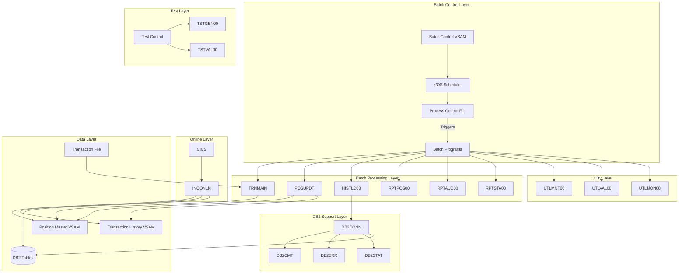

### 1.2 Component Descriptions

#### 1.2.1 Batch Control Components

- **Batch Control File (BCHCTL)**
  - Controls process execution
  - Maintains process status
  - Supports checkpoint/restart
- **Process Control File (PRCCTL)**
  - Defines process sequence
  - Specifies dependencies
  - Sets completion criteria

#### 1.2.2 Processing Components

- **TRNMAIN (TRNVAL00)**

  - Validates input transactions
  - Performs initial error checking
  - Prepares transactions for processing

- **POSUPDT (POSUPD00)**

  - Updates position records
  - Maintains cost basis
  - Records transaction history

- **HISTLD00**

  - Loads history to DB2
  - Maintains audit trail
  - Supports reporting

- **RPP (RPTPOS00)**

  - Generates daily position reports
  - Calculates portfolio valuations
  - Produces transaction summaries
  - Creates position reconciliation reports

- **RPA (RPTAUD00)**

  - Produces security audit reports
  - Tracks process execution
  - Generates exception reports
  - Maintains compliance documentation

- **RPS (RPTSTA00)**

  - Monitors system performance
  - Tracks resource utilization
  - Generates trend analysis
  - Reports operational metrics

- **INQONLN**
  - Handles online inquiries
  - Provides position lookups
  - Shows transaction history

#### 1.2.3 Utility Components

- **UTLMNT00 (File Maintenance)**

  - Performs file maintenance operations
  - Handles archiving and cleanup
  - Manages VSAM reorganization
  - Controls space management

- **UTLMON00 (System Monitor)**

  - Tracks resource utilization
  - Collects performance metrics
  - Monitors system thresholds
  - Generates alerts

- **UTLVAL00 (Data Validation)**
  - Performs data integrity checks
  - Validates cross-references
  - Verifies data formats
  - Reconciles balances

#### 1.2.4 Test Components

- **TSTGEN00 (Test Data Generator)**

  - Generates test portfolios
  - Creates test transactions
  - Produces error scenarios
  - Supports volume testing

- **TSTVAL00 (Test Validation)**
  - Executes test cases
  - Validates results
  - Measures performance
  - Produces test reports

#### 1.2.5 Reporting Components

- **RPTPOS00 (Position Report Generator)**

  - Generates daily position reports
  - Calculates portfolio valuations
  - Produces transaction summaries
  - Creates position reconciliation reports

- **RPTAUD00 (Audit Report Generator)**

  - Produces security audit reports
  - Tracks process execution
  - Generates exception reports
  - Maintains compliance documentation

- **RPTSTA00 (Statistics Report Generator)**
  - Monitors system performance
  - Tracks resource utilization
  - Generates trend analysis
  - Reports operational metrics

#### 1.2.6 Online Components

- **Core Inquiry Programs**

  - **INQONLN (Main Online Controller)**

    - Manages main menu navigation
    - Controls screen flow
    - Handles user input/output
    - Coordinates sub-programs

  - **INQPORT (Portfolio Inquiry)**

    - Processes portfolio lookups
    - Displays position details
    - Shows portfolio summaries
    - Handles portfolio search

  - **INQHIST (History Inquiry)**
    - Retrieves transaction history
    - Displays audit information
    - Provides historical lookups
    - Supports date range queries

- **Online Support Components**

  - **CURSMGR (Cursor Manager)**

    - Handles cursor positioning
    - Manages screen navigation
    - Controls field selection
    - Supports PF key processing

  - **SECMGR (Security Manager)**

    - Validates user access
    - Controls authorization
    - Manages session security
    - Logs security events

  - **ERRHNDL (Error Handler)**
    - Processes online errors
    - Formats error messages
    - Manages error recovery
    - Logs error information

- **DB2 Online Components**

  - **DB2ONLN (Online DB2 Controller)**

    - Manages DB2 connections
    - Controls transaction scope
    - Handles connection pooling
    - Optimizes DB2 access

  - **DB2RECV (DB2 Recovery)**
    - Handles DB2 errors
    - Manages recovery actions
    - Controls session cleanup
    - Maintains connection state

## 2. Process Flows

### 2.1 Batch Control Flow


### 2.2 Transaction Processing Flow


### 2.3 Online Inquiry Flow


### 2.4 Reporting Flow

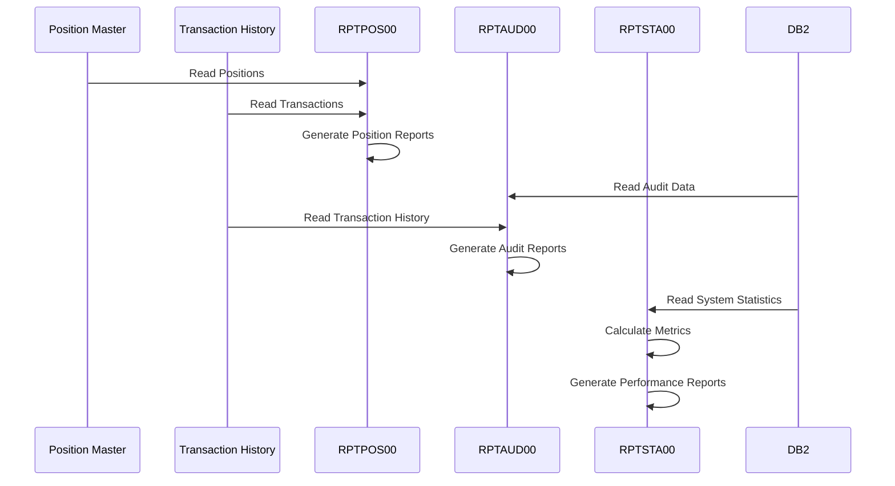

### 2.5 Online Processing Flow

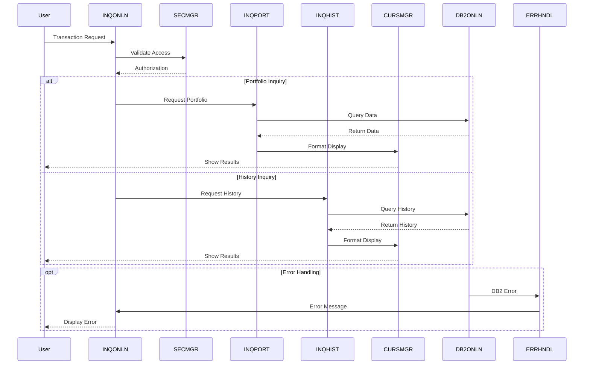

## 3. File Organization

### 3.1 Project Structure

```
src/
├── cics/                  # CICS Resource Definitions
│   └── PORTDFN.csd       # Portfolio CICS definitions
├── copybook/             # COBOL Copybooks
│   ├── batch/           # Batch processing copybooks
│   ├── common/          # Shared copybooks
│   ├── db2/            # DB2 interface copybooks
│   └── online/         # Online processing copybooks
├── database/            # Database Definitions
│   ├── db2/            # DB2 table and index definitions
│   └── vsam/           # VSAM file definitions
├── jcl/                 # JCL Procedures
│   ├── batch/          # Batch processing JCL
│   ├── portfolio/      # Portfolio management JCL
│   ├── test/           # Test execution JCL
│   └── utility/        # Utility program JCL
├── maps/               # BMS Screen Definitions
│   └── INQSET.bms     # Inquiry screen maps
├── programs/           # COBOL Source Programs
│   ├── batch/         # Batch processing programs
│   ├── common/        # Shared subroutines
│   ├── online/        # Online transaction programs
│   ├── portfolio/     # Portfolio management programs
│   ├── test/          # Test programs
│   └── utility/       # Utility programs
└── templates/          # Standard Program Templates
    ├── database/      # DB2 handling templates
    ├── error/         # Error handling templates
    └── program/       # Standard program templates
```

### 3.2 Component Categories

#### 3.2.1 Source Programs

- **Batch Programs**: Core batch processing components
- **Online Programs**: CICS transaction programs
- **Portfolio Programs**: Portfolio management functions
- **Utility Programs**: System maintenance utilities
- **Test Programs**: Test generation and validation
- **Common Programs**: Shared subroutines

#### 3.2.2 Supporting Components

- **Copybooks**: Shared data definitions and structures
- **JCL**: Job control procedures for all components
- **Maps**: BMS screen definitions for online interface
- **Templates**: Standard code patterns and structures

#### 3.2.3 Database Components

- **DB2 Definitions**: Table, index, and stored procedures
- **VSAM Definitions**: File and cluster definitions
- **CICS Definitions**: Resource and transaction definitions

### 3.3 File Dependencies

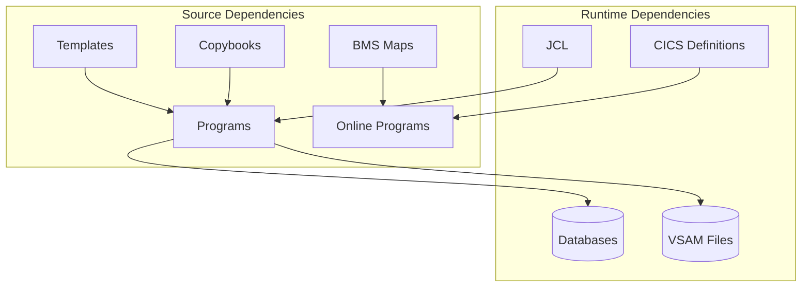

## 4. Batch Processing Architecture

### 4.1 Job Flow

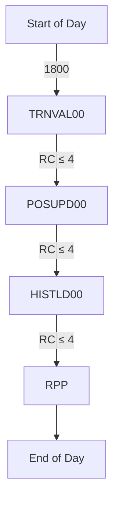

### 4.2 Checkpoint/Restart Framework


## 5. System Interfaces

### 5.1 Program Dependencies

#### 5.1.1 Batch Program Dependencies

| Program  | Dependencies     | Input Files         | Output Files       | DB2 Access |
| -------- | ---------------- | ------------------- | ------------------ | ---------- |
| BCHCTL00 | ERRPROC          | Control File        | Status Updates     | Write      |
| POSUPDT  | DB2CONN, ERRPROC | Transaction File    | Position Master    | Read/Write |
| HISTLD00 | DB2CONN, ERRPROC | Transaction History | DB2 Tables         | Write      |
| RPTPOS00 | DB2CONN, ERRPROC | Position Master     | Position Reports   | Read       |
| RPTAUD00 | DB2CONN, ERRPROC | Audit Log           | Audit Reports      | Read       |
| RPTSTA00 | DB2CONN, ERRPROC | System Stats        | Statistics Reports | Read       |

#### 5.1.2 Utility Program Dependencies

| Program  | Dependencies     | Input Files    | Output Files      | DB2 Access |
| -------- | ---------------- | -------------- | ----------------- | ---------- |
| UTLMNT00 | ERRPROC          | Control File   | Archive Files     | None       |
| UTLVAL00 | DB2CONN, ERRPROC | Multiple Files | Validation Report | Read       |
| UTLMON00 | DB2CONN, ERRPROC | Monitor Config | Monitor Log       | Read/Write |

#### 5.1.3 Test Program Dependencies

| Program  | Dependencies     | Input Files | Output Files    | DB2 Access |
| -------- | ---------------- | ----------- | --------------- | ---------- |
| TSTGEN00 | ERRPROC          | Test Config | Test Data Files | None       |
| TSTVAL00 | DB2CONN, ERRPROC | Test Cases  | Test Results    | Read       |

#### 5.1.4 Online Program Dependencies

| Program | Dependencies     | Resources Used     | Security Level |
| ------- | ---------------- | ------------------ | -------------- |
| INQONLN | SECMGR, CURSMGR  | CICS, BMS Maps     | Transaction    |
| INQPORT | DB2ONLN, ERRHNDL | DB2, VSAM Files    | Resource       |
| INQHIST | DB2ONLN, ERRHNDL | DB2, History Files | Resource       |
| CURSMGR | None             | BMS Maps           | None           |
| SECMGR  | DB2ONLN          | Security Tables    | System         |
| DB2ONLN | DB2RECV          | DB2 Connection     | Database       |
| DB2RECV | ERRHNDL          | DB2 Connection     | Database       |
| ERRHNDL | None             | Error Log          | None           |

### 5.2 Interface Flow Diagrams

#### 5.2.1 Batch Interface Flow

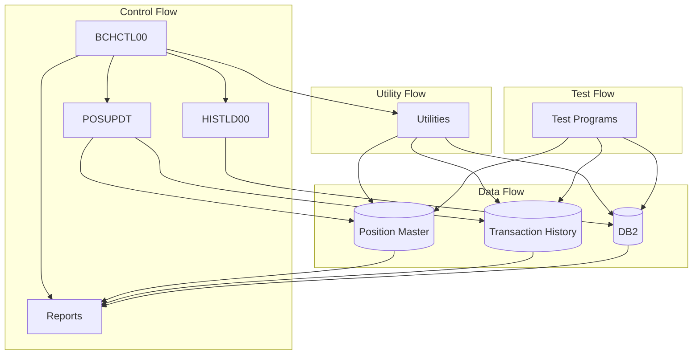

#### 5.2.2 Online Interface Flow

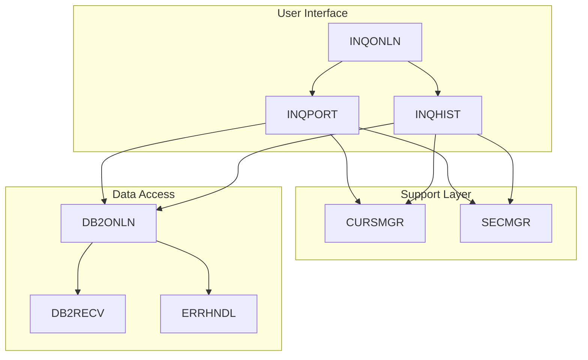

## 6. Error Handling and Recovery

### 6.1 Error Handling Components

#### 6.1.1 Common Error Handlers

- **ERRPROC (Batch Error Processor)**

  - Standard error handling for batch programs
  - Error message formatting
  - Return code management
  - Error logging and reporting

- **ERRHNDL (Online Error Handler)**

  - CICS error processing
  - User message management
  - Screen error display
  - Session recovery

- **DB2ERR (DB2 Error Handler)**
  - SQL error processing
  - Connection error recovery
  - Deadlock resolution
  - Transaction rollback management

#### 6.1.2 Error Flow

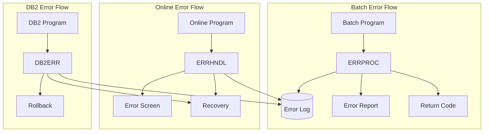

### 6.2 Recovery Procedures

#### 6.2.1 Batch Recovery

- **Checkpoint/Restart**

  ```mermaid
  sequenceDiagram
      participant BP as Batch Program
      participant CP as Checkpoint
      participant RC as Recovery
      participant CF as Control File

      BP->>CP: Write Checkpoint
      CP->>CF: Update Status

      alt Failure Occurs
          CF->>RC: Read Last Checkpoint
          RC->>BP: Restart Position
      end
  ```

#### 6.2.2 Online Recovery

- **Transaction Recovery**

  ```mermaid
  sequenceDiagram
      participant US as User
      participant TR as Transaction
      participant ER as ERRHNDL
      participant DB as DB2RECV

      TR->>ER: Error Detected
      ER->>DB: Initiate Recovery
      DB->>TR: Rollback
      ER->>US: Error Message
  ```

### 6.3 Error Handling Matrix

| Component Type | Error Handler | Recovery Method | Logging | User Notification |
| -------------- | ------------- | --------------- | ------- | ----------------- |
| Batch Core     | ERRPROC       | Checkpoint      | Yes     | Report            |
| Online Core    | ERRHNDL       | Session         | Yes     | Screen            |
| DB2 Access     | DB2ERR        | Rollback        | Yes     | Message           |
| Utilities      | ERRPROC       | Restart         | Yes     | Report            |
| Test Programs  | ERRPROC       | None            | Yes     | Report            |

### 6.4 Error Prevention Strategies

#### 6.4.1 Data Validation

- Input data validation
- Cross-reference checking
- Balance verification
- Format validation

#### 6.4.2 Process Validation

- Status checking
- Sequence verification
- Dependency validation
- Resource availability

#### 6.4.3 System Validation

- Environment verification
- Resource allocation
- Security validation
- Configuration checking

## 7. Performance and Monitoring

### 7.1 Monitoring Architecture

#### 7.1.1 System Monitor (UTLMON00)

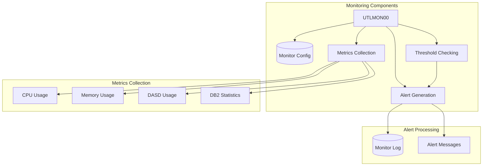

#### 7.1.2 Monitoring Points

- **Resource Monitoring**

  - CPU utilization
  - Memory usage
  - DASD space
  - DB2 statistics

- **Performance Monitoring**

  - Response times
  - Transaction rates
  - DB2 performance
  - Batch duration

- **Process Monitoring**
  - Job status
  - Error rates
  - Recovery events
  - Security incidents

### 7.2 Performance Management

#### 7.2.1 Batch Performance

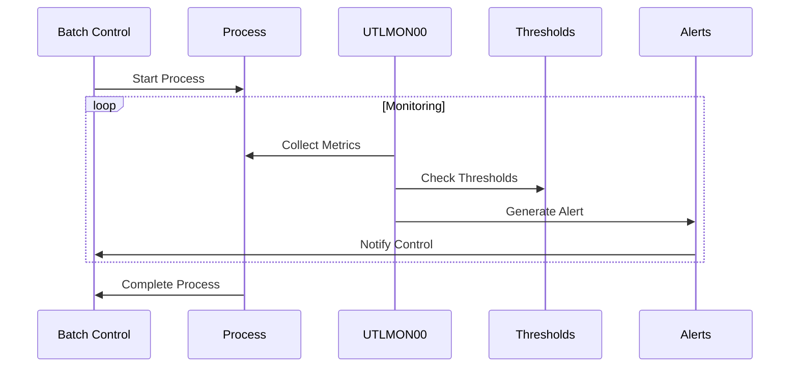

## 8. Security Architecture

### 8.1 Security Components

#### 8.1.1 Security Manager (SECMGR)

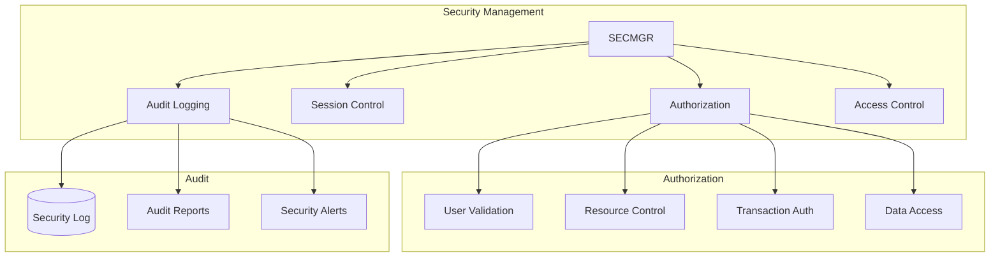

### 8.2 Security Layers

#### 8.2.1 System Security

- **z/OS Security**

  - RACF integration
  - Dataset protection
  - Program control
  - System access

- **CICS Security**
  - Transaction security
  - Resource security
  - Command security
  - File access control

#### 8.2.2 Application Security

```mermaid
sequenceDiagram
    participant USR as User
    participant CIC as CICS
    participant SEC as SECMGR
    participant DB2 as DB2
    participant AUD as Audit

    USR->>CIC: Transaction Request
    CIC->>SEC: Validate Access
    SEC->>DB2: Check Authorization
    alt Authorized
        DB2-->>SEC: Grant Access
        SEC-->>CIC: Allow Transaction
        CIC-->>USR: Process Request
        SEC->>AUD: Log Access
    else Unauthorized
        DB2-->>SEC: Deny Access
        SEC-->>CIC: Reject Transaction
        CIC-->>USR: Access Denied
        SEC->>AUD: Log Violation
    end
```

### 8.3 Security Matrix

#### 8.3.1 Resource Access Controls

| Resource Type | Batch Access | Online Access | Utility Access | Security Check |
| ------------- | ------------ | ------------- | -------------- | -------------- |
| VSAM Files    | Program Auth | CICS Auth     | Program Auth   | RACF + SECMGR  |
| DB2 Tables    | Plan Auth    | Plan Auth     | Plan Auth      | DB2 + SECMGR   |
| Programs      | RACF         | CICS          | RACF           | RACF           |
| Utilities     | RACF         | N/A           | RACF           | RACF           |

#### 8.3.2 Transaction Security

| Transaction Type | Security Level | Validation | Logging | Recovery |
| ---------------- | -------------- | ---------- | ------- | -------- |
| Inquiry          | Read           | SECMGR     | Yes     | Session  |
| Update           | Update         | SECMGR     | Yes     | Rollback |
| Maintenance      | Admin          |

## 9. Monitoring and Control

### 9.1 Batch Monitoring

- Process status tracking
- Return code checking
- Resource utilization
- Completion verification

### 9.2 Online Monitoring

- Transaction response time
- Resource availability
- Error rate tracking
- User session management

## Sprint 4 (Online Integration) - Planning

**Goal**: Implement CICS online inquiry functionality

### Online Programs

1. INQONLN (Main Online Handler)

   - [ ] Basic CICS infrastructure
   - [ ] Screen mapping
   - [ ] Portfolio position inquiry
   - [ ] Transaction history lookup
   - [ ] Error handling integration

2. Online DB2 Support

   - [ ] Connection pooling
   - [ ] Read-only access patterns
   - [ ] Response time optimization
   - [ ] Error recovery procedures

3. Security Integration

   - [ ] CICS security definitions
   - [ ] DB2 authorization
   - [ ] Access logging
   - [ ] Audit trail integration

4. BMS Screen Definitions
   - [ ] Main menu
   - [ ] Portfolio inquiry screen
   - [ ] Transaction history screen
   - [ ] Error messages screen

### Infrastructure

1. CICS Resources

   - [ ] Transaction definitions
   - [ ] Program definitions
   - [ ] File definitions
   - [ ] DB2 entry definitions

2. Documentation
   - [ ] Online user guide
   - [ ] Operations manual updates
   - [ ] Security documentation
   - [ ] Performance guidelines

### Exit Criteria

- Complete INQONLN implementation
- Working CICS transactions
- Security integration
- Documentation updates

## 10. Documentation

### 10.1 Documentation Components

#### 10.1.1 Technical Documentation

| Document            | Purpose                            | Location                                        | Update Frequency |
| ------------------- | ---------------------------------- | ----------------------------------------------- | ---------------- |
| System Architecture | System design and structure        | /documentation/technical/system-architecture.md | Per Release      |
| Data Dictionary     | Data definitions and relationships | /documentation/technical/data-dictionary.md     | Per Change       |
| Security Guide      | Security implementation details    | /documentation/technical/security-guide.md      | Per Release      |
| Performance Guide   | Performance optimization guide     | /documentation/technical/performance-guide.md   | Quarterly        |

#### 10.1.2 Operations Documentation

| Document            | Purpose                       | Location                                      | Update Frequency |
| ------------------- | ----------------------------- | --------------------------------------------- | ---------------- |
| JCL Reference       | JCL procedures and parameters | /documentation/operations/jcl-reference.md    | Per Change       |
| Utilities Guide     | System utility documentation  | /documentation/operations/utilities-guide.md  | Per Release      |
| Monitoring Guide    | System monitoring procedures  | /documentation/operations/monitoring-guide.md | Quarterly        |
| Recovery Procedures | System recovery documentation | /documentation/operations/recovery-guide.md   | Per Release      |
